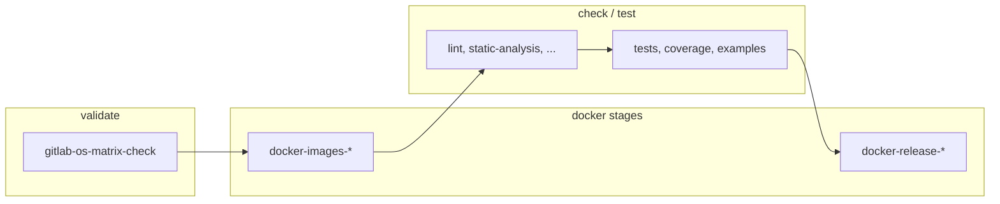

# GitLab CI: pipeline and architecture

This document describes the **GitLab CI/CD** pipeline for this CircuitGen repository (Parameters, Graph, or Generator). It is **kept in sync** across the three repositories; the only intentional difference is **`REPO_NAME`** in `.gitlab-ci.yml` (`parameters` / `graph` / `generator`) and the resulting image paths in the registry.

For a full script reference, see [CI_SCRIPTS.md](CI_SCRIPTS.md).

---

## 1. High-level architecture

- **Orchestration:** GitLab Runner with the **Docker** executor, tag **`docker`**.
- **Image builds:** jobs use **`docker:27`** (via registry proxy cache) plus a **Docker-in-Docker (dind)** service `docker:27-dind`. The runner must allow **`privileged = true`**.
- **Code checks (lint, tests, …):** jobs run on **`$DOCKER_CI_IMAGE`**, i.e. the CI image built from `dockerfile/Dockerfile.ci` and pushed to your registry (`REGISTRY_URL` / `GROUP_NAME` / `REPO_NAME`).
- **Registry mirrors:** `.gitlab-ci.yml` sets Harbor projects **`DOCKER_HUB_PROXY_PROJECT`** and **`DOCKER_GITLAB_PROXY_PROJECT`** so client/dind and some base layers are pulled through the proxy (rate limits, speed).

---

## 2. Workflow rules (`.gitlab-ci.yml`)

- Commit message contains **`[skip ci]`** → pipeline is **skipped**.
- Draft merge requests → pipeline is **skipped**.
- **`DOCKER_CI_TAG`** (tag for `ci` / `dev` / `release` images in the registry) is set by `workflow` rules depending on pipeline source (simplified):
  - **Git tag** → `DOCKER_CI_TAG = CI_COMMIT_TAG`;
  - **Merge request** when `CI_MERGE_REQUEST_REF_SLUG` is set → `DOCKER_CI_TAG = CI_COMMIT_REF_SLUG`;
  - **Merge request** otherwise → `DOCKER_CI_TAG = CI_COMMIT_SHORT_SHA`;
  - **Branch push** → `DOCKER_CI_TAG = CI_COMMIT_REF_SLUG`;
  - **Fallback** → `DOCKER_CI_TAG = CI_COMMIT_SHORT_SHA`.

See the top of `.gitlab-ci.yml` in the repo for the exact conditions.

---

## 3. Stages

| Stage | Purpose |
|--------|---------|
| **validate** | Ensures generated `.gitlab-ci.yml` blocks match `scripts/config/supported-os.sh` (`generate-gitlab-os-matrix.sh --check`). |
| **docker-ubuntu** | Build and push **ci** images (and, per rules, **dev**) for **Ubuntu 24.04** — primary source of `$DOCKER_CI_IMAGE` for later stages. |
| **check** | Lint, static analysis, sanitizers in the default CI image (Ubuntu 24.04). |
| **test** | Unit tests, coverage, examples in the same CI image. |
| **docker-matrix** | **ci** images for other OS entries; **release** images after tests succeed (some jobs are tag-only). |
| **check-os** / **test-os** | Same checks on **secondary OS** images (see `rules` / `.secondary-os-matrix-rules`). |
| **os-check** | Full install-deps and scenario checks on “clean” OS images (`os-image-build-push` + `os-full-check`), higher `timeout`. |
| **docs** | Documentation build (Doxygen, etc.) with path-based `rules`. |
| **release** | GitLab Release creation on version tags (`create-gitlab-release.sh`). |

---

## 4. OS matrix and YAML generation

- Single source of truth: **`scripts/config/supported-os.sh`**.
- **`scripts/ci/generate-gitlab-os-matrix.sh`** rewrites marked sections in **`.gitlab-ci.yml`** (`# BEGIN generated` … `# END generated`).
- After changing supported OSes, run **`--write`** and commit the updated `.gitlab-ci.yml`. CI **validate** runs **`--check`**.

---

## 5. Docker images in CI

- **CI:** `Dockerfile.ci`, variables `DOCKERFILE_CI_NAME`, `DOCKER_CI_SYSTEM`, push to `$DOCKER_URL/<os>/ci:$DOCKER_CI_TAG`.
- **Dev:** `Dockerfile.dev` — build in jobs is limited to **tags and the default branch** (see the embedded `if` in `.gitlab-ci.yml`); the local **dev** image is removed in **`after_script`** to avoid filling the dind disk.
- **Release:** `Dockerfile.release` — for tags; the local **release** image is also removed in **`after_script`**.
- Skip redundant rebuilds: **`docker-skip-if-unchanged.sh`** (manifest exists in registry and git diff does not touch Docker context paths), invoked from `docker-build-*.sh` when **`CI`** is set.
- **`resource_group`** on docker/os jobs serializes builds per project/OS.

---

## 6. Local runs (CI parity)

- **`bash scripts/ci/run-task.sh <task>`** — one task (`lint`, `tests`, …): locally or in a container (`CI_RUNNER=docker`, `CI_IMAGE_TAG=...`).
- **`bash scripts/ci/run-all.sh`** — runs a sequence of CI scripts.

More detail: [CI_SCRIPTS.md](CI_SCRIPTS.md), [SCRIPTS.md](SCRIPTS.md), [HACKING.md](HACKING.md).

---

## 7. Windows runner maintenance

For hosts using **Docker Desktop (WSL2)** where disk usage grows, use **`scripts/ci/docker-prune-keep-bases.ps1`**. Full instructions: [CI_SCRIPTS.md §7](CI_SCRIPTS.md#docker-prune-runner-windows) (EN) / [Russian version](../ru/CI_SCRIPTS.md#docker-prune-runner-windows). This is **not** a default GitLab job step; it is manual or scheduled host maintenance.
