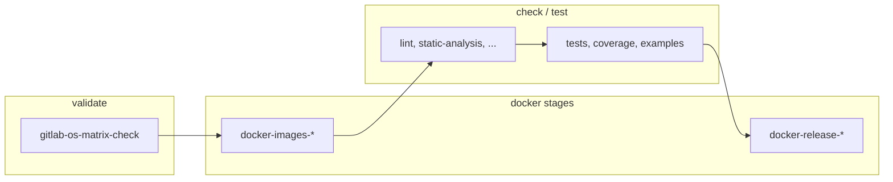

# GitLab CI: конвейер и архитектура

Документ описывает конвейер **GitLab CI/CD** этого репозитория (CircuitGen: Parameters, Graph или Generator). Файл **синхронизируется** между тремя репозиториями; отличие только в переменной **`REPO_NAME`** в `.gitlab-ci.yml` (`parameters` / `graph` / `generator`) и в путях образов в registry.

Подробный справочник по скриптам: [CI_SCRIPTS.md](CI_SCRIPTS.md).

---

## 1. Общая архитектура

- **Оркестратор:** GitLab Runner с **Docker executor**, тег **`docker`**.
- **Сборка образов:** job’ы на образе **`docker:27`** (через proxy cache registry) + сервис **Docker-in-Docker (dind)** `docker:27-dind`. Нужен Runner с **`privileged = true`**.
- **Проверки кода (lint, тесты, …):** job’ы на **`$DOCKER_CI_IMAGE`** — образ CI, собранный из `dockerfile/Dockerfile.ci` и опубликованный в ваш registry (`REGISTRY_URL` / `GROUP_NAME` / `REPO_NAME`).
- **Кэш Docker Hub / GitLab:** в `.gitlab-ci.yml` задаются проекты Harbor **`DOCKER_HUB_PROXY_PROJECT`** и **`DOCKER_GITLAB_PROXY_PROJECT`**; client/dind и часть баз тянутся через proxy, чтобы снизить лимиты и ускорить pull.

---

## 2. Правила workflow (`.gitlab-ci.yml`)

- Коммит с **`[skip ci]`** в сообщении — pipeline **не** запускается.
- Черновики MR (**Draft** / флаг draft) — pipeline **не** запускается.
- Переменная **`DOCKER_CI_TAG`** (тег образов `ci` / `dev` / `release` в registry) задаётся правилами `workflow` в зависимости от источника pipeline (упрощённо):
  - **тег** репозитория → `DOCKER_CI_TAG = CI_COMMIT_TAG`;
  - **merge request** при наличии `CI_MERGE_REQUEST_REF_SLUG` → `DOCKER_CI_TAG = CI_COMMIT_REF_SLUG`;
  - **merge request** иначе → `DOCKER_CI_TAG = CI_COMMIT_SHORT_SHA`;
  - **push в ветку** → `DOCKER_CI_TAG = CI_COMMIT_REF_SLUG`;
  - иначе → `DOCKER_CI_TAG = CI_COMMIT_SHORT_SHA`.

Точные условия смотрите в начале `.gitlab-ci.yml` в репозитории.

---

## 3. Стадии (stages)

| Стадия | Назначение |
|--------|------------|
| **validate** | Проверка, что сгенерированные блоки `.gitlab-ci.yml` совпадают с `scripts/config/supported-os.sh` (`generate-gitlab-os-matrix.sh --check`). |
| **docker-ubuntu** | Сборка и push образов **ci** (и при правилах — **dev**) для **Ubuntu 24.04** — основной источник `$DOCKER_CI_IMAGE` для последующих стадий. |
| **check** | Линт, статический анализ, санитайзеры в образе CI по умолчанию (Ubuntu 24.04). |
| **test** | Юнит-тесты, покрытие, примеры в том же образе CI. |
| **docker-matrix** | Образы **ci** для остальных ОС из матрицы; **release**-образы после успешных тестов (часть job’ов только на теги). |
| **check-os** / **test-os** | Те же проверки на **вторичных ОС** (ограничения `rules`, см. `.secondary-os-matrix-rules`). |
| **os-check** | Полная проверка установки зависимостей и сценариев на «чистых» образах ОС (`os-image-build-push` + `os-full-check`), увеличенный `timeout`. |
| **docs** | Сборка документации (Doxygen и др.) по `rules` / изменениям путей. |
| **release** | Создание GitLab Release на тегах (`create-gitlab-release.sh`). |

---

## 4. Матрица ОС и генерация YAML

- Единый источник списка ОС: **`scripts/config/supported-os.sh`**.
- Скрипт **`scripts/ci/generate-gitlab-os-matrix.sh`** переписывает помеченные блоки в **`.gitlab-ci.yml`** (`# BEGIN generated` … `# END generated`).
- После изменения поддерживаемых ОС выполните **`--write`**, затем закоммитьте обновлённый `.gitlab-ci.yml`. В CI стадия **validate** гоняет **`--check`**.

---

## 5. Образы Docker в CI

- **CI:** `Dockerfile.ci`, переменные `DOCKERFILE_CI_NAME`, `DOCKER_CI_SYSTEM`, публикация в `$DOCKER_URL/<os>/ci:$DOCKER_CI_TAG`.
- **Dev:** `Dockerfile.dev` — сборка в job’ах ограничена **тегами и default branch** (см. встроенный `if` в `.gitlab-ci.yml`); локально на runner после job образ **dev** удаляется в **`after_script`**, чтобы не забивать диск dind.
- **Release:** `Dockerfile.release` — для тегов; локальный образ **release** также снимается в **`after_script`**.
- Пропуск лишних пересборок: **`docker-skip-if-unchanged.sh`** (образ уже в registry и git diff не затрагивает пути контекста) вызывается из `docker-build-*.sh` при **`CI`**.
- **`resource_group`** на docker/os job’ах сериализует сборки по проекту и ОС, чтобы не пересекались push’и.

---

## 6. Локальный запуск как в CI

- **`bash scripts/ci/run-task.sh <task>`** — одна задача (`lint`, `tests`, …): локально или в контейнере (`CI_RUNNER=docker`, `CI_IMAGE_TAG=...`).
- **`bash scripts/ci/run-all.sh`** — последовательный прогон набора скриптов.

Подробнее: [CI_SCRIPTS.md](CI_SCRIPTS.md), [SCRIPTS.md](SCRIPTS.md), [HACKING.md](HACKING.md).

---

## 7. Обслуживание runner (Windows)

Для хостов с **Docker Desktop (WSL2)** и накоплением данных используйте **`scripts/ci/docker-prune-keep-bases.ps1`** и руководства **`docker-prune-keep-bases.md`** / **`docker-prune-keep-bases.en.md`** — это **не** шаг GitLab job’а по умолчанию, а ручное/плановое обслуживание диска.
